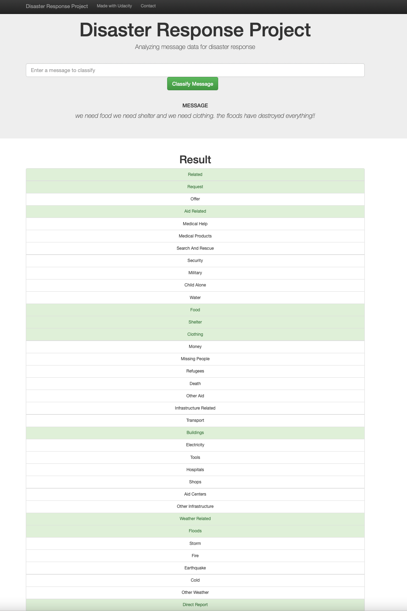

# Disaster Message Classifier

The Disaster Message Classifier is a set of ETL & ML scripts - combined with a web app that can be used to classify a disaster event related message into appropriate categories, such as Fire, Earthquake, Floods etc. Since there are 36 categories in total, the model solves a multilabel Natural Language Processing classification problem i.e. each message can belong to multiple categories. For example, the message "we need food and shelter after the earthquake in our region" will have labels food, shelter, earthquake, direct report, etc.

This is a portfolio project, offered by Udacity, to showcase data engineering and modelling skills on a small dataset.

A walkthrough notebook for the project can be found [here](https://github.com/sajal2692/disaster-message-classifier/blob/master/notebook/walkthrough.ipynb).

## Files:
- `data/process_data.py`: The ETL pipeline used to process data in preparation for model building.
- `models/train_classifier.py`: The Machine Learning pipeline used to fit, tune, evaluate, and export the model to a Python pickle (pickle is not uploaded to the repo due to size constraints.).
- `app/templates/*.html`: HTML templates for the web app.
- `run.py`: Start the Python server for the web app and prepare visualizations.s

## Instructions:

1. Install dependencies using requirements.txt
    `pip install -r requirements.txt`

2. Run the following commands in the project's root directory to set up your database and model.

    - To run ETL pipeline that cleans data and stores in database
        `python data/process_data.py data/disaster_messages.csv data/disaster_categories.csv data/DisasterResponse.db`
    - To run ML pipeline that trains classifier and saves
        `python models/train_classifier.py data/DisasterResponse.db models/classifier.pkl`

3. Run the following command to run your web app.
    `python app/run.py`

4. Go to http://0.0.0.0:3001/

Please raise an issue if these instructions don't work for you!

## Further Improvements

This repo sticks to the basics in order to provide a good baseline model for this classification task. There is plenty of room for improvement here, including but not limited to:

1. Using word embeddings (GloVe, word2vec) or even sentence embeddings (Univsersal Sentgence Encoder) to transform message text, instead of using a CountVectorizer. This should allow the model to generalize well to similar/unseen words and improve the model accuracy too.
2. A Neural Network can be trained for this task. Better yet, a pre-trained state-of-the-art transformer based network can be fine tuned using the data available to us. 
3. Certain classification categories are "noisy" such as "related" or "child alone" (no positive examples). These can either be removed, or more data can be acquired that provides enough missing examples for such cases.

## Screenshot:

Check out my [Data Science Portfolio](https://github.com/sajal2692/data-science-portfolio) repository, or my [website](https://sajalsharma.com) for more Data Science and Machine Learning Projects.
